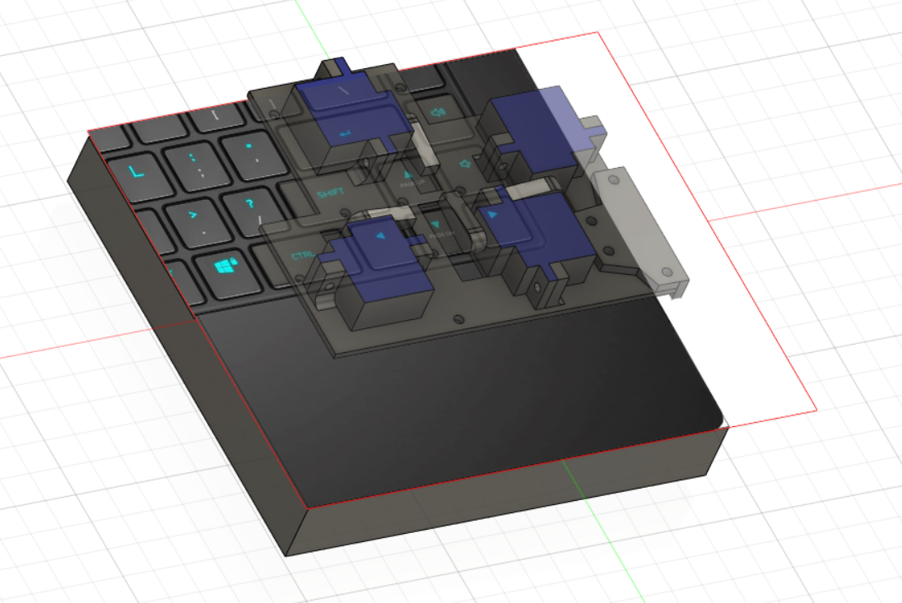
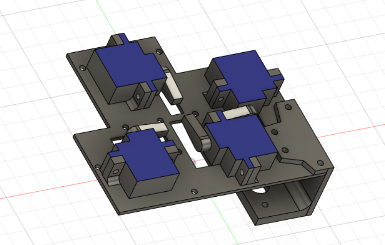

# game-joystick

## What will it do ?

The system will wirelessly control the arrow keys on a laptop keyboard using a joystick and some servos. The servos will physically press the arrow keys after receiving the joystick's X and Y positions. 

## Components

### Sender 

- Raspberry Pi Pico W

- KY-023 analog joystick module

- ESP8266 Wifi module

### Receiver

- Arduino Nano

- ESP8266 Wifi module

- Servos

### 3D-printed support

The support will hold 4 servos (one for each arrow key).

## How will it work?

The Raspberry Pi Pico W will read the user input from the KY-023 analog joystick module, which is possible by connecting the joystick pins to the ADC (analog-to-digital converter) pins on the Pico board. The Pico board will then transfer the data to the Arduino Nano wirelessly, which is handled via Wifi-direct between the two ESP8266 Wifi modules. The Arduino will read the data through the serial communication pins (TX/RX), and control the servos.

